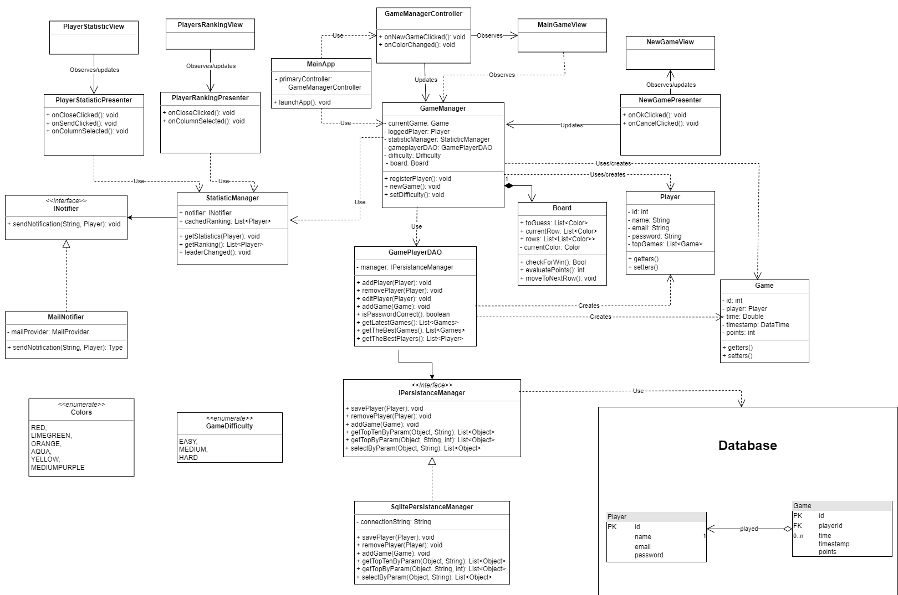
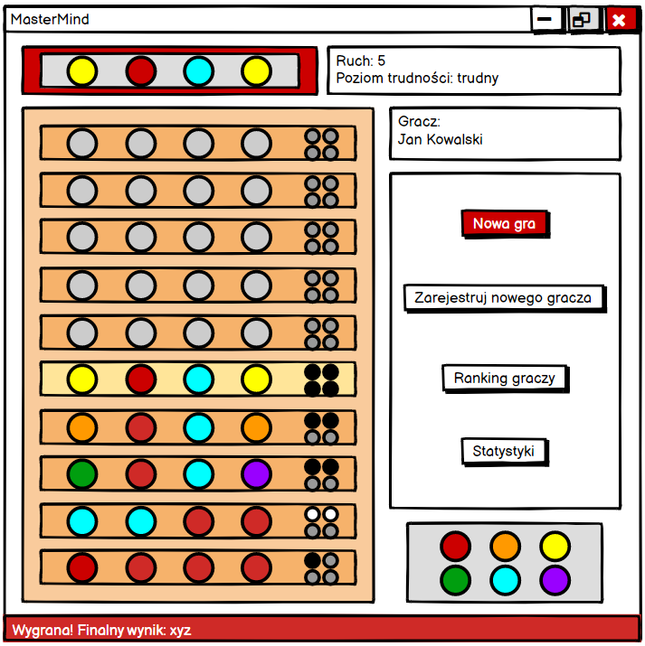
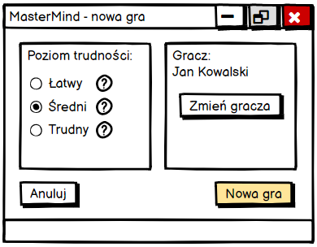

# MasterMind

## Technologie Obiektowe Czwartek 11:15

### Autorzy:

Zespół nr II 'Bagno' w składzie:

- Jan Bugajski
- Michał Faciszewski
- Marcin Kocot
- Tomasz Ukowski

# Opis

Projekt przedstawia implementację gru MasterMind, w której gracz może rywalizować z wirtualnym przeciwnikiem posiadającym różne poziomy zdolności. Dodatkowo rozgrywka wzbogacona jest o prezentację aktualnych statystyk wybranego gracza, a także system rankingowy, wysyłający powiadomienia email, w przypadku zmiany leadera rankingu.

### Wykorzystane technologie

- [ ] Technologia bazodanowa (np. Sqlite)
- [x] Java 16
- [x] Gradle
- [ ] RxJava
- [x] JavaFx
- [x] Guice

# Struktura projektu

Projekt jest w głównej mierze budowany w oparciu o wzorzec projektowy MVC, jednakże poszczególne okna dialogowe wykorzystując zależności zawarte we wzorcu MVP.



### Model biznesowy

Głównymi elementami logiki biznesowej są klasy **Game** oraz **Player**, które modeluje składowe rzeczywistej gry. Elementy te są również zapisywane w bazie danych.

Innym istotnym elementem jest **GameManager** główna klasa zarządzajaca przebiegiem gry. Jej nieodłącznym fragmentem jest oczywiście **Board** przechowująca stan aktualnej gry.

#### Persystencja

Persystencja w stworzonej przez nas aplikacji opiera się na zastosowaniu wzorca **Data Access Object**. Znaczna przewaga
tego rozwiązania polega na odseparowaniu implementacji bazodanowej od reszty aplikacji. Pozwala to na odrębną prace nad
kolejnymi fragmentami aplikacji, jak również ewentualnymi modyfkacjami podejścia bazodanowego np. zmiany technologii. Do
jej obsługi przeznaczone są **GamePlayerDAO** oraz interfejs **PersistanceManager**.

Dodatkowo w celu odwrócenia zależności pomiedzy implementacją wyżej wspomnianego intefrejsu i klasy DAO wykorzystaliśmy
mechanizm kontenera GoogleGuice, który zadba o zachowanie zdanej struktury klas, bez definiowania zależności wewnątrz.

Do przechowywania bazy danych wykorzystaliśmy technologię MongoDB, wraz z serwerem Atlas, umożliwiającym przechowywanie
bazy danych w chmurze. Dokumenty podzielone sa pomiędzy dwie kolekcje:

- **Player** - przechowującą graczy:

```json
{
  "_id": "hashedPlayerId",
  "name": "Player1",
  "email": "player1@mail.com",
  "password": "player1Pass!"
}
```

- **Game** - przechowującą graczy:

```json
{
  "_id": "hashedGameId",
  "player_id": "hashedPlayerId",
  "points": 10,
  "time": 10,
  "timestamp": "2021-12-08T19:40:57.329Z"
}
```

Odpowiedzalny za zarządzanie statystykami **StatisticManager**. Obserwuje on klasę **GameManager** w oczekiwaniu na nowe dane statystyczne, o których powiadomi graczy za pomoca interfejsu **INotifier**.

Istinieje również kilka klas pomocniczych np. **Colors**, **GameDifficulty**.

### Kontroler/Prezenter

Tutaj możemy wyróżnić 4 elementy zarządzające 4 różnymi widokami, jest to:

- **GameManagerController** - odpowiedzialny za obsługe zdarzeń w obecnej grze,
- **PlayerStatisticPresenter** - odpowiedzialny za przesłanie informacji statystycznych i obsługe zdarzeń w oknie statystyk,
- **PlayerRankingPresenter** - odpowiedzialny za przesłanie informacji rankingowych i obsługe zdarzeń w oknie rankingu,
- **NewGamePresenter** - odpowiedzialny za obsługę okna dodania nowego gracza.

### Widok

Adekwatnie do wyróżnionych 4 kontrolerów, aplikacja dysponuje 4 różnymi widokami:

- **MainGameView** - prezentacja stanu obecnej rozgrywki,

  

- **PlayerStatisticView** - prezentacja statystyk gracza,
- **PlayerRankingView** - prezentacja rankingu graczy,
- **NewGameView** - możliwość prowadzenia danych o nowym graczu.

  

### Inne

Odrębną klasą od reszty elementów jest klasa **MainApp**, gdyż odpowiada ona jedynie za uruchomienie projektu.

# Postępy prac

|                          Zadanie                          | Wykonano |             Kto             |
| :-------------------------------------------------------: | :------: | :-------------------------: |
|              Analiza problemu i podział prac              |    ✅    | Jan, Michał, Marcin, Tomasz |
|          Utworzenie budowania projektu (Gradle)           |    ✅    |       Marcin, Tomasz        |
|             Utworzenie interfejsu graficznego             |    ✅    |       Marcin, Tomasz        |
|          Utworzenie diagramu klas i dokumentacji          |    ✅    |         Jan, Michał         |
|            Utworzenie kompletnego modelu klas             |    ✅    |         Jan, Michał         |
|          Analiza wymagań M2 i podział obowiązków          |    ✅    | Jan, Michał, Marcin, Tomasz |
|  Dodanie implementacji komunikacji i obsługi bazy danych  |    ✅    |           Michał            |
|        Wprowadzenie odwrócenia zależności z guice         |    ✅    |           Michał            |
|   Aktualizacja dokumentacji o opis warstwy persystencji   |    ✅    |           Michał            |
|  Przygotowanie widoków logowania, rejestracji, nowej gry  |    ✅    |           Tomasz            |
|        Implementacja metod klas GameManager, Game         |    ✅    |       Marcin, Tomasz        |
|              Implementacja metod klasy Board              |    ✅    |       Marcin, Tomasz        |
| Komunikacja na linii model - widoki za pomocą prezenterów |    ✅    |           Marcin            |
|          Implementacja medot klas GamePlayerDAO           |    ✅    |             Jan             |
|     Poprawienie błędów związanych z logowaniem gracza     |    ✅    |             Jan             |
